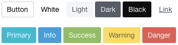
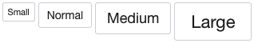
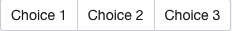

## LuxJS
LuxJS is a JavaScript library that makes it easy to create modern and powerful user web-interfaces. It's built on top of [Bulma](https://github.com/jgthms/bulma). Written in three different versions: [jQuery](https://jquery.com/), [AngularJS](https://angularjs.org/) and [VueJS](http://vuejs.org/). Crafted with love.

#### NOTE:
LuxJS is in currently in active development.

**v1.0.0 components**
* <del>Button</del> ✔
* <del>Group Button</del> ✔
* Tooltip
* Form (validations)
* Notification
* Progress Bar
* Modal
* Tabs

## Table of Contents
* [Installation](#installation)
* [Documentation](#documentation)

## Installation
Clone or download the project and include files of **dist** folder into your project. Then import the files into your HTML code.

### CSS
You can import Bulma and Lux CSS files separately
````html
<link rel="stylesheet" href="bulma.css">
<link rel="stylesheet" href="lux.css">
````
**or** just use the combined version which contains both
````html
<link rel="stylesheet" href="lux.combined.css">
````

### JavaScript
#### jQuery Version
````html
<script src="jquery.lux.js"></script>
````
#### AngularJS Version
````html
<script src="angular.lux.js"></script>
````
Inject Lux to your app
````javascript
angular.module('yourApp', ['Lux']);
````
#### VueJS Version
````html
<script src="vue.lux.js"></script>
````
Don't forget to install Lux before using it
````javascript
Vue.use(Lux);
````

## Documentation

### Buttons
#### jQuery Version
````html
<button id="foo">Bar</button>
````
````javascript
$('#foo').button();
````
The example above will create a really simple button. You can also use options like it's shown below
````javascript
$('#foo').button({
  type: 'primary',
  size: 'large',
  style: 'outlined' // or inverted
});
````
##### Types

##### Sizes


Change the state of the button
````javascript
$('#foo').button().loading();
// or
$('#foo').button('loading');
// and
$('#foo').button('reset'); // .
bring it back to normal

var btn = $('#foo').button();
btn.loading();
btn.disable();
// chaining with jQuery methods
btn.addClass('someClass').html('Awesome Button').enable();
````
##### States


Another handy feature is using a promise to change the state of the button
````javascript
var httpRequest = $.get('http://jsonplaceholder.typicode.com/posts/1');

$('#foo').button('loading', httpRequest);
// or
$('#foo').button().loading(httpRequest);
// or disable it
$('#foo').button('disable', httpRequest);
// you can also use your own class
$('#foo').button('yourClass andAnother', httpRequest);
````
Button will be at normal state after the request is complete

### Button Group

#### jQuery Version
````html
<p id="choices">
  <button data-value="foo">Choice 1</button>
  <button data-value="bar">Choice 2</button>
  <button data-value="baz">Choice 3</button>
</p>
````
````javascript
$('#choices').buttonGroup();
// retrieve the choosen value
$('#choices').data('value');
````

#### AngularJS Version
````html
<div button-group="choice">
  <button data-value="foo">Choice 1</button>
  <button data-value="bar">Choice 2</button>
  <button data-value="baz">Choice 3</button>
</div>
````
````javascript
function yourController($scope) {
  $scope.choice = "foo"; // pre-select Choice 1
}
````

#### VueJS Version
````html
<div id="container">
  <div v-button-group="choice">
    <button data-value="foo">Choice 1</button>
    <button data-value="bar">Choice 2</button>
    <button data-value="baz">Choice 3</button>
  </p>
</div>
````
````javascript
new Vue({
  el: '#container',
  data: {
    choice: 'foo' // pre-select Choice 1
  }
});
````