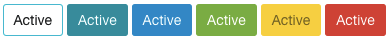
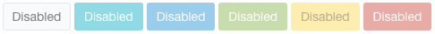

# LuxJS
LuxJS is a JavaScript library that makes it easy to create modern and powerful user web-interfaces. It's built on top of [Bulma](https://github.com/jgthms/bulma). Written in three different versions: [jQuery](https://jquery.com/), [AngularJS](https://angularjs.org/) and [VueJS](http://vuejs.org/). Crafted with love.

#### NOTE:
LuxJS is in currently in active development.

**v1.0.0 components**
* <del>Button</del> ✓
* <del>Group Button</del> ✓
* <del>Tooltip</del> ✓
* Form
  * <del>Validations</del> ✓
  * Styling
* Notification
* Progress Bar
* Modal
* Tabs

## Table of Contents
* [Installation](#installation)
* [Documentation](#documentation)

## Installation
Clone or download the project and include files of **dist** folder into your project. Then import the files into your HTML code.

### CSS
You can import Bulma and Lux CSS files separately
````html
<link rel="stylesheet" href="bulma.css">
<link rel="stylesheet" href="lux.css">
````
**or** just use the combined version which contains both
````html
<link rel="stylesheet" href="lux.combined.css">
````

### JavaScript

#### jQuery Version
````html
<script src="jquery.lux.js"></script>
````

#### AngularJS Version
````html
<script src="angular.lux.js"></script>
````
Inject Lux to your app
````javascript
angular.module('yourApp', ['Lux']);
````

#### VueJS Version
````html
<script src="vue.lux.js"></script>
````
Don't forget to install Lux before using it
````javascript
Vue.use(Lux);
````

## Documentation

### Buttons

#### jQuery Version [Live Example](https://jsfiddle.net/Tsalikidis/y15ckoon/)
````html
<button id="foo">Bar</button>
````
````javascript
$('#foo').button();
````
The example above will create a really simple button. You can also use options like it's shown below
````javascript
$('#foo').button({
  type: 'primary',
  size: 'large',
  style: 'outlined' // or inverted
});
````

##### Types


##### Sizes


Change the state of the button
````javascript
$('#foo').button().loading();
// or
$('#foo').button('loading');
// and
$('#foo').button('reset'); // back to normal

var btn = $('#foo').button();
btn.loading();
btn.disable();
// chaining with jQuery methods
btn.addClass('someClass').html('Awesome Button').enable();
````

##### States




Another handy feature is using a promise to change the state of the button
````javascript
var httpRequest = $.get('http://jsonplaceholder.typicode.com/posts/1');

$('#foo').button('loading', httpRequest);
// or
$('#foo').button().loading(httpRequest);
// or disable it
$('#foo').button('disable', httpRequest);
// you can also use your own class
$('#foo').button('yourClass andAnother', httpRequest);
````
Button will be at normal state after the request is complete

#### AngularJS Version [Live Example](https://jsfiddle.net/Tsalikidis/p9snc2us/)
````html
<lbutton type="primary" size="small">Small Button</lbutton>
````
You can bind variables in order to control button states
````html
<lbutton loading="{{users.search.searching}}" ng-click="search()">Search</lbutton>
````
````javascript
function yourController($scope, $http) {
  $scope.users = {
    search: {
      results: [],
      searching: false
    }
  };
  
  $scope.search = function() {
    $scope.users.search.searching = true;
    $http.get('/search')
      .then(function(results) {
        $scope.users.search.results = results;
        // do something with results...
      })
      .finally(function() {
        $scope.users.search.searching = false;
      });
  }
}
````

#### VueJS Version [Live Example](https://jsfiddle.net/Tsalikidis/z36m4p4q/)
````html
<button v-lbutton type="primary" size="small">Small</button>
````
Bind variables to state
````html
<div class="container">
  <button v-lbutton v-bind:loading="foo">Load Button</button>
</div>
````
````javascript
new Vue({
  el: '.container',
  data: {
    foo: false
  }
});
````

### Button Group


#### jQuery Version [Live Example](https://jsfiddle.net/Tsalikidis/sp79gzo6/)
````html
<p id="choices">
  <button data-value="foo">Choice 1</button>
  <button data-value="bar">Choice 2</button>
  <button data-value="baz">Choice 3</button>
</p>
````
````javascript
$('#choices').buttonGroup();
// retrieve the choosen value
$('#choices').data('value');
````

#### AngularJS Version [Live Example](https://jsfiddle.net/Tsalikidis/acwpqp6s/)
````html
<div button-group="choice">
  <button data-value="foo">Choice 1</button>
  <button data-value="bar">Choice 2</button>
  <button data-value="baz">Choice 3</button>
</div>
````
````javascript
function yourController($scope) {
  $scope.choice = "foo"; // pre-select Choice 1
}
````

#### VueJS Version [Live Example](https://jsfiddle.net/Tsalikidis/0qqynbgb/)
````html
<div class="container">
  <div v-button-group="choice">
    <button data-value="foo">Choice 1</button>
    <button data-value="bar">Choice 2</button>
    <button data-value="baz">Choice 3</button>
  </div>
</div>
````
````javascript
new Vue({
  el: '.container',
  data: {
    choice: 'foo' // pre-select Choice 1
  }
});
````

### Tooltip


#### jQuery Version
````html
<button data-tooltip="This is a tooltip">Tooltip Button</button>
<span data-tooltip="Tooltip placed at the bottom">Span with tooltip</span>
````
````javascript
$('button').tooltip();

$('span').tooltip({
  placement: 'bottom',
  tigger: 'click'
});
````

#### AngularJS Version
````html
<button tooltip="Tooltip on button">Button</button>

<span tooltip="Another Tooltip" placement="right" trigger="click">Click to show tooltip</span>

<!-- dynamic content tooltip -->
<div tooltip="{{foo}}">Tooltip content changes dynamically</div>
````

#### VueJS Version
````html
<button v-tooltip="'Tooltip on button'">Button</button>

<span v-tooltip="'Another Tooltip'" placement="right" trigger="click">Click to show tooltip</span>

<!-- dynamic content tooltip -->
<div v-tooltip="foo">Tooltip content changes dynamically</div>
````

### Form Validations


Available validations:
* required
* email
* url
* length[min]-[max]
* digits[min]-[max]
* number[min]-[max]
* equals
* checked
#### jQuery Version
````html
<form>
  <label class="label">Name</label>
  <p class="control">
    
    <input valid-required class="input" type="text">
  
  </p>
  <label class="label">Username</label>
  <p class="control">
    
    <input valid-length="4-20" class="input" type="text">
  
  </p>
  <label class="label">Email</label>
  <p class="control">
    
    <input valid-email class="input" type="text">
  
  </p>
  <label class="label">Pin Code</label>
  <p class="control">
    
    <input valid-digits="4-*" class="input" type="text">
  
  </p>
  <label class="label">Website</label>
  <p class="control">
    
    <input valid-url class="input" type="text">
  
  </p>
  <label class="label">Choose one</label>
  <p class="control">
    
    <input valid-equals="foo|bar|baz" class="input" type="text">
  
  </p>
  <p class="control">
    <label class="checkbox">
      
      <input type="checkbox" valid-checked="true">
      
      Check me
    </label>
  </p>
</form>
````
````javascript
$('form').form();
````